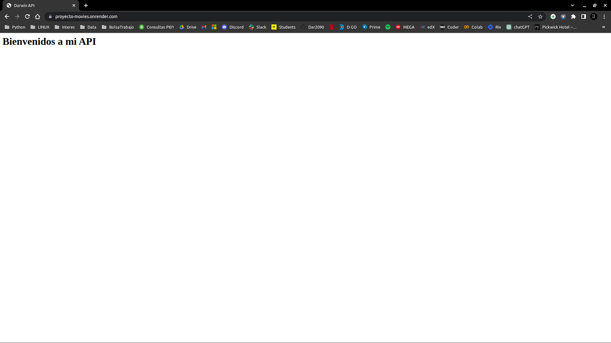
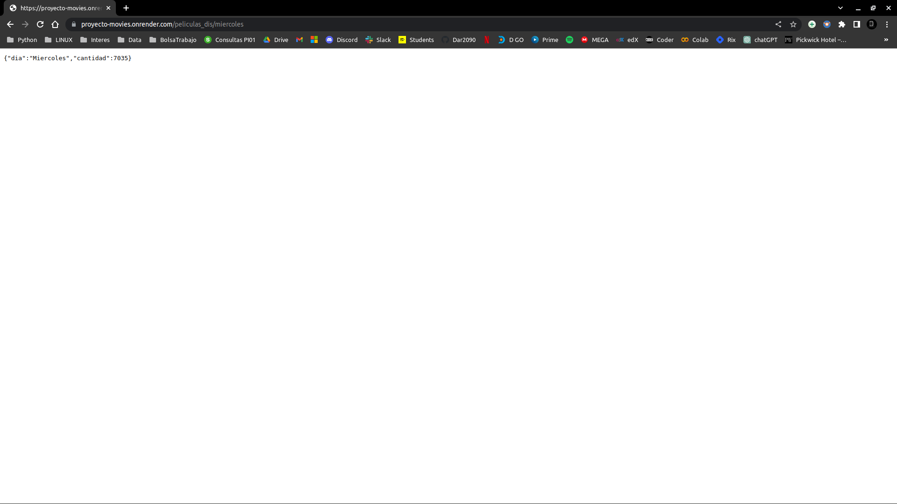
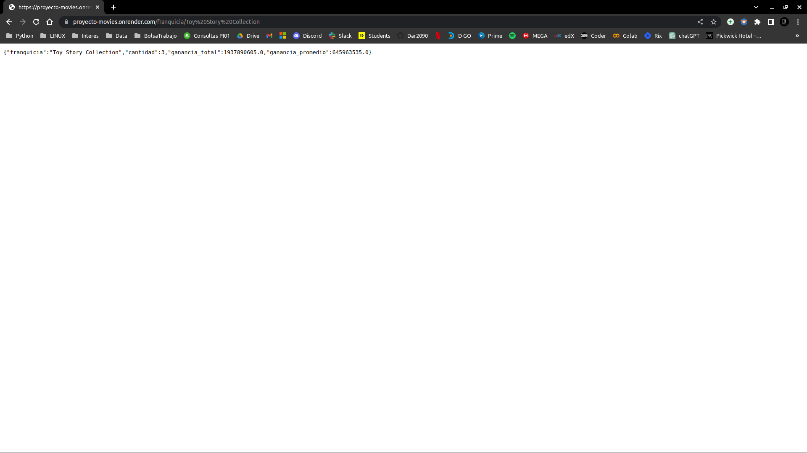

<p align=center><p>

# <h1 align=center> **PROYECTO MOVIES** </h1>


¡Bienvenidos a mi primer proyecto individual de la etapa de labs! Estare ocupando el rol de un ***MLOps Engineer***. 


## **Descripcion**

Este proyecto invidividual (PI) termina con el deploy de una API totalmente funcional, **SPOILER ALERT** --> [Darwin API](https://proyecto-movies.onrender.com/) <-- Pero es solo eso, un spoiler, mas adelante te mostrare como navegar por mi API y que hace. Te adelanto que te encontraras con algunos terminos confusos pero tratare de explicarlos de la mejor manera posible.

Este proyecto se subdivide en dos partes: una de Data Engineer (Ingenieria de Datos) donde hacemos el ETL (Extraccion-Transformacion-Carga) de los datos, se desarrola desde cero una API con la ayuda del framework [FastAPI](https://fastapi.tiangolo.com/es/) y finalizamos haciendo el Deploy de nuestra API por medio [Render](https://render.com/) que es una nube unificada para crear y ejecutar aplicaciones y sitios web, entre otros. En el archivo *ETL_endpoints.ipynb* encontraras el desarrollo de esta parte junto con la creacion de funciones a ser usadas en los endpoints de FastAPI.

Por otro lado tenemos la parte de Machine Learning (ML) donde crearemos un sistema de recomendacion de peliculas donde haremos un EDA (Analisis Exploratorio de Datos), donde, una vez finalizado decidiremos que datos son relevantes para ser usados por nuestro modelo de recomendacion. En los archivos *EDA.ipynb* y *Modelo.ipynb* encontraras el desarrollo de esta parte

Este PI muestra un ETL realizado sobre un dataset con informacion de peliculas: title(titulo), genres(genero), release_date(fecha de lanzamiento), budget(presupuesto), revenue(ganancia) y demas. Se trato de hacer las transformaciones necesarias para que los datos llegue a la siguiente parte del proyecto lo mejor posible.

El EDA presenta algunos reportes en que los puedes encontrar en la carpeta *Reportes*.

El modelo de ML es un modelo no supervisado basado en contenido.

Te dejo un pequeno video explicativo y muy bueno de como crear una API con Python [Video](https://www.youtube.com/watch?v=J0y2tjBz2Ao) asi entiendes un poco que hace el archivo *main.py*. Ademas el video incluye la creacion de un entorno virtual.


## **Instalacion**

Te recomiendo instalar las librerias contenidas en el archivo *requirements.txt* asi te aseguro el correcto funcionamiento de los notebooks. Ademas te cuento que hay versiones de librerias especificas para el funcionamiento de render. Tambien te recomiendo hacer todo esto dentro de un entorno virtual de preferencia asi evitamos problemas con las librerias que ya tengas instaladas en tu computadora.

```bash
pip install -r requirements.txt
```
Asegurate de ubicarte en el directorio donde se encuentra el archivo requirements.txt antes de ejecutar el comando.

Esto instalará automáticamente todas las librerías y las versiones especificadas en el archivo requirements.txt. Cada línea del archivo debe contener el nombre de la libreria y, opcionalmente, la versión especifica o restricciones de version.

Si deseas utilizar un entorno virtual (recomendado), primero activa el entorno virtual antes de ejecutar el comando.


## **Recorrido por la API**

Para probar mi API desde ingresar puedes ingresar haciendo click aca --> [Darwin API](https://proyecto-movies.onrender.com/) <-- 

Te vas a encontrar con la pantalla de bienvenida en la url raiz:


    
<p align="center">

</p>


Para ir al endpoint que retorna la cantidad de peliculas que se estrenaron ese mes historicamente puedes ingresar por aca -->[Consulta con el mes Enero](https://proyecto-movies.onrender.com/peliculas_mes/enero) <-- o agrega al final de la url raiz /peliculas_mes/{mes} donde debes sustituir {mes} por el mes de tu preferencia:


<p align="center">

</p>


Para ir al endpoint que retorna la cantidad de peliculas que se estrenaron ese dia historicamente puedes ingresar por aca -->[Consulta con el dia Lunes](https://proyecto-movies.onrender.com/peliculas_dis/lunes) <-- o agrega al final de la url raiz /peliculas_dis/{dis} donde debes sustituir {dis} por el dia de tu preferencia:


<p align="center">

</p>


Para ir al endpoint que retorna la cantidad de peliculas, ganancia total y promedio puedes ingresar por aca -->[Consulta con la franquicia Toy Story Collections](https://proyecto-movies.onrender.com/franquicia/Toy%20Story%20Collection) <-- o agrega al final de la url raiz /franquicia/{franquicia} donde debes sustituir {franquicia} por la franquicia de tu preferencia.

Te dejo algunas para probar:

* Toy Story Collection
* Grumpy Old Men Collection
* Father of the Bride Collection


<p align="center">

</p>


Para ir al endpoint que retorna la cantidad de peliculas producidas en el pais puedes ingresar por aca -->[Consulta con el pais Germany](https://proyecto-movies.onrender.com/peliculas_pais/Germany) <-- o agrega al final de la url raiz /peliculas_pais/{pais} donde dedes sustituir {pais} por el pais de tu preferencia:


<p align="center">

</p>


Para ir al endpoint que retorna la ganancia total y la cantidad de peliculas que produjo una productora puedes ingresar por aca -->[Consulta con la productora Twentieth Century Fox Film Corporation](https://proyecto-movies.onrender.com/productoras/Twentieth%20Century%20Fox%20Film%20Corporation) <-- o agrega al final de la url raiz /productoras/{productora} donde debes sustituir {productora} por la productora de tu preferencia:

Te dejo algunas para probar:

* Pixar Animation Studios
* TriStar Pictures, Teitler Film, Interscope Com...
* Warner Bros., Lancaster Gate
* Twentieth Century Fox Film Corporation
* Sandollar Productions, Touchstone Pictures
* Sine Olivia
* American World Pictures
* Yermoliev


<p align="center">

</p>


Para ir al endpoint que retorna la inversion, la ganancia, el retorno y el año en el que se lanzo una pelicula especifica puedes ingresar por aca -->[Consulta con la pelicula Toy Story 2](https://proyecto-movies.onrender.com/retorno/Toy%20Story%202) <-- o agrega al final de la url raiz /retorno/{titulo} donde debes sustituir {titulo} por el nombre de la pelicula de tu preferencia:


<p align="center">

</p>


Para ir al endpoint del modelo donde ingresas un nombre de pelicula y te recomienda las similares en una lista, puedes ingresar por aca -->[Consulta con la pelicula The Sentinel](https://proyecto-movies.onrender.com/recomendacion/The%20Sentinel) <-- o agrega al final de la url raiz /recomendacion/{Titulo} donde debes sustituir {titulo} por el nombre de la pelicula de tu preferencia.

Te en cuenta que para este punto estaremos usando un datasets reducido para la consulta, esto porque al hacer el deploy en una plataforma que ofrece servicios gratuitos, estos no alcanzan para entrenar un modelo con la totalidad de los datos. En el fuuro encontraremos alguna otra solucion en la nube que me permita trabajar con la totalidad de lso datos.


<p align="center">

</p>


## **Video**

Te dejo un enlace a un [video](https://youtu.be/xQTr93WAanU) que muestra un poco el funcionamiento de la pagina donde esta la API.


## **Fuente de datos**

Aca podes descargar el dataset original y tambien un diccionario con informacion de las columnas que posee el dataset.

+ [Dataset](https://drive.google.com/file/d/1Rp7SNuoRnmdoQMa5LWXuK4i7W1ILblYb/view?usp=sharing)

+ [Diccionario de datos](https://docs.google.com/spreadsheets/d/1QkHH5er-74Bpk122tJxy_0D49pJMIwKLurByOfmxzho/edit#gid=0)
<br/>